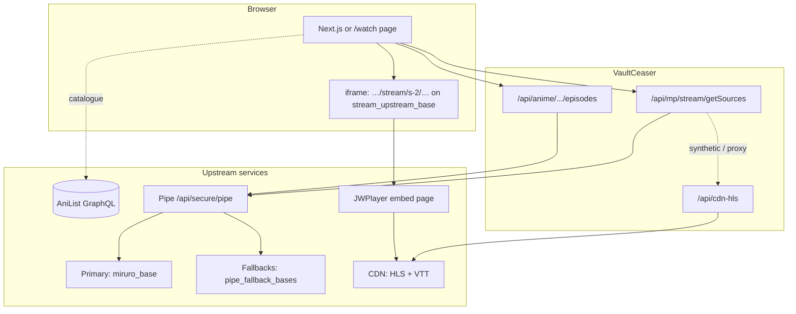

# VaultCeaser

FastAPI backend plus a Next.js web app for browsing anime and playing streams. Episode metadata and stream resolution go through Miruro-style **pipe** APIs; playback can use **vidwish.live**’s upstream player (same pattern as the HAR captures in `research/`).

## Quick start

While the server runs: OpenAPI + try-it at **`/docs`**, human-readable reference at **`/docs.html`** (same file as `docs.html` in the repo).

```bash
# Backend (default http://0.0.0.0:8080)
pip install -r requirements.txt
python server.py
```

```bash
# Web UI — point it at the API (default matches server)
cd web && npm install && npm run dev
# Set NEXT_PUBLIC_API_URL if the API is not on http://localhost:8080
```

Watch page in the **server** (embedded list + iframe): `http://localhost:8080/watch/{anilistId}`  
Example: `http://localhost:8080/watch/182205`

## Configuration

Path: `config.json` (override with env `VAULTCEASER_CONFIG`).

| Key | Purpose |
|-----|---------|
| `miruro_base` | Primary site hosting `/api/secure/pipe` (e.g. `https://www.miruro.tv`). |
| `pipe_fallback_bases` | Extra pipe origins tried in order if the primary fails or is circuit-open. Same pipe contract required. |
| `pipe_dead_ttl` | Seconds a failed pipe base is deprioritized before retry (default `120`). |
| `stream_upstream_base` | Megaplay / embed origin used for JWPlayer and CDN referer alignment (e.g. `https://vidwish.live`). |
| `embed_s2_mode` | `upstream` = real `…/stream/s-2/…` iframe on `stream_upstream_base`; `synthetic` / `proxy` = local player or proxied HTML. |
| `cdn_host_suffixes` | Host suffix allowlist for `/api/cdn-hls` when proxying segments or playlists. |
| `embed_asset_hosts` | Hosts allowed when rewriting embed assets. |
| `anilist_url` | GraphQL endpoint for catalogue data. |

Changing `miruro_base` and/or `pipe_fallback_bases` lets you move to a new pipe provider **without code changes**—restart the server after editing config.

## Health and stability

- **`GET /api/health`** — Per configured pipe base: HTTP reachability (HEAD), latency, whether the circuit breaker considers it open. Overall `status` is `ok` if at least one base responds.
- **`GET /health`** — Lightweight process liveness (if exposed by your deployment).

Pipe calls (`call_pipe`) walk **alive bases first**, then bases marked dead until TTL expires. Transient network or 5xx errors mark a base dead for `pipe_dead_ttl` seconds; **4xx from the pipe** (bad query, etc.) is not treated as “host down” for the whole base.

## API surface (stable patterns)

| Area | Typical routes |
|------|------------------|
| Catalogue | `/api/homepage`, `/api/trending`, `/api/anime/{id}`, … |
| Episodes | `/api/anime/{id}/episodes`, `/api/anime/{id}/stream` |
| Stream details | `/api/sources`, `/api/stream/url`, `/api/stream/iframe` |
| Megaplay proxy | `/api/mp/...` (embed pages, `getSources`, etc.) |
| CDN proxy | `/api/cdn-hls?u=…&r=…` (HLS / VTT with per-CDN `Referer`) |
| Raw pipe | `POST /api/pipe` (advanced; same encoding as upstream) |

The Next app uses `NEXT_PUBLIC_API_URL` + `web/src/lib/api.ts` to call these routes.

## Research docs

See [`research/README.md`](research/README.md) for HAR-based analysis (streaming chain, pipe encoding, obfuscation). That folder is the **reference** for why headers and URLs look the way they do.

---

## How the end-to-end flow works

High level: the **browser** talks only to **VaultCeaser**. VaultCeaser talks to **AniList** for metadata, to one or more **pipe bases** for episode lists and stream payloads, and to **vidwish / CDNs** for playback when using upstream embed or the CDN proxy.



**Upstream mode (`embed_s2_mode: upstream`)**: Episodes carry slug IDs from the pipe; `getSources` normalizes pipe `streams` / `subtitles`, exposes numeric IDs in embed URLs, and the iframe loads **vidwish.live** (or your `stream_upstream_base`) so JWPlayer pulls HLS the same way as in the HAR.

**Synthetic / proxy modes**: More traffic goes through VaultCeaser (`/api/cdn-hls`, local player), with `r=` carrying per-stream **Referer** so Cloudflare-aligned CDNs still accept the proxy.

---

*Solid lines: normal request paths. Dashed lines: optional (catalogue via AniList; CDN proxy only in synthetic/proxy embed modes). Inside the server, `call_pipe` hits `miruro_base` first, then each URL in `pipe_fallback_bases`, skipping bases in the short-lived “dead” state until `pipe_dead_ttl` expires.*
