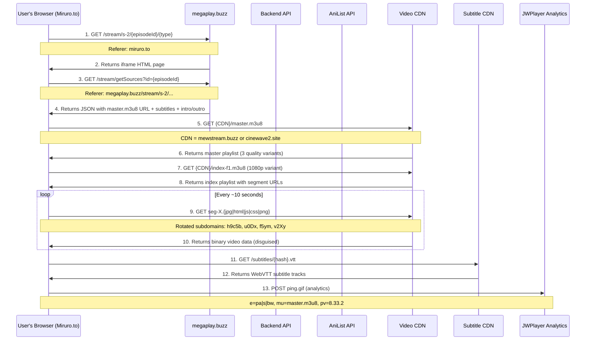
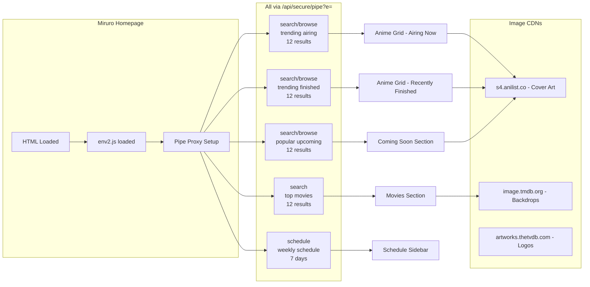
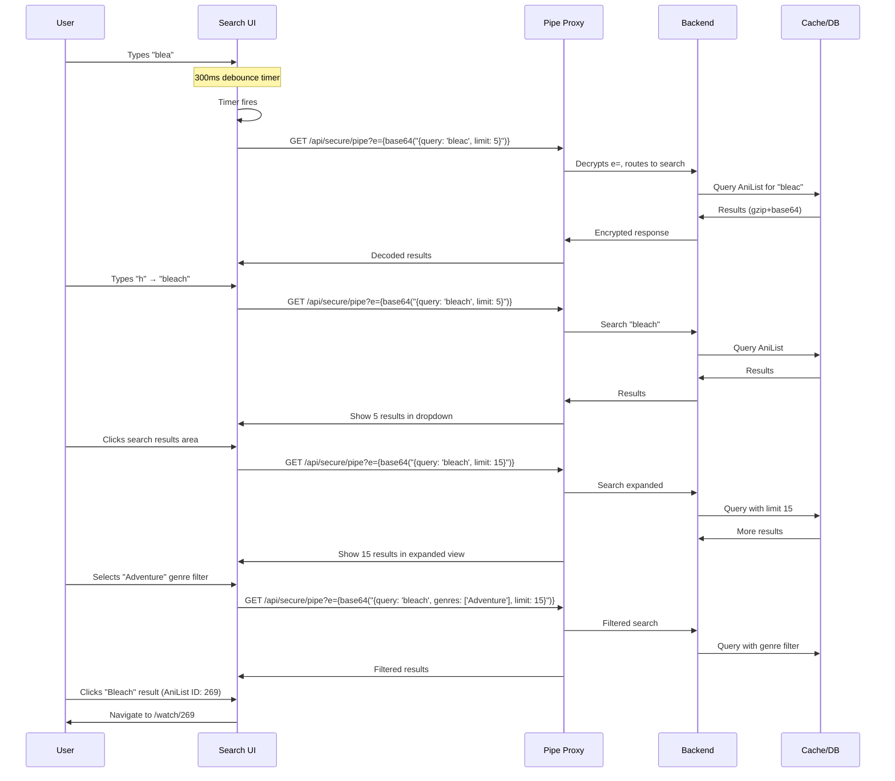
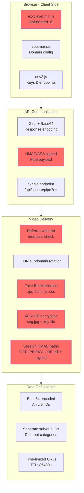

# Architecture Diagrams

> Mermaid diagrams illustrating the Megaplay.buzz streaming pipeline, homepage data flow, and search feature.

> **Note:** These diagrams use [Mermaid](https://mermaid.js.org/) syntax. They render natively on GitHub, in VS Code with the Mermaid plugin, or at [mermaid.live](https://mermaid.live).

---

## 1. Complete Streaming Pipeline



---

## 2. Anti-Hotlinking & Referrer Whitelist Flow

```mermaid
flowchart TD
    A[User Browser] -->|Referer: miruro.to| B[Megaplay Backend]
    
    B --> C{Check /domains whitelist}
    C -->|Referer NOT in whitelist| D[Reject: 403/404]
    C -->|Referer IS in whitelist| E{Validate HMAC session token}
    
    E -->|Invalid token| D
    E -->|Valid token| F{Check TTL}
    
    F -->|Expired > 24h| D
    F -->|Valid session| G[Serve Content]
    
    G --> H{Content type}
    H -->|AES-128 encrypted| I[Serve seg.jpg + key]
    H -->|Clear text| J[Serve seg.{fake ext}]
    
    subgraph Whitelist[/domains endpoint]
        K[Base64 decoded JSON array]
        K --> L[~40 domains: 9anime, AniWave, HiAnime...]
    end
    
    B -->|GET /domains?h=2026051520| K
```

---

## 3. Homepage Data Loading



---

## 4. Search Feature Flow



---

## 5. Multi-Layer Obfuscation Stack



---

## 6. Network Host Map

```mermaid
graph TD
    subgraph Frontend
        M[miruro.to<br/>Main website]
        MB[megaplay.buzz<br/>Streaming iframe]
    end
    
    subgraph Configuration
        E[env2.js<br/>Keys & proxies]
        A[app.main.js<br/>Domains & config]
        P[e1-player.min.js<br/>Player logic]
    end
    
    subgraph API
        PP[/api/secure/pipe?e=<br/>Universal proxy]
        GS[/stream/getSources<br/>Video metadata]
        DM[/domains?h=<br/>Referrer whitelist]
    end
    
    subgraph Data_Sources
        AL[s4.anilist.co<br/>Anime metadata & art]
        TM[image.tmdb.org<br/>Movie backdrops]
        TV[artworks.thetvdb.com<br/>Series artwork]
        YT[i.ytimg.com<br/>Trailer thumbnails]
    end
    
    subgraph CDN_Streaming
        MW[cdn.mewstream.buzz<br/>HLS video]
        CW[s2.cinewave2.site<br/>HLS video]
        UC[pru.ultracloud.cc<br/>AES encrypted HLS]
        SQ[u0Dx.sparqle.click<br/>Segment delivery]
        GL[f5ym.glimmeron.click<br/>Segment delivery]
        OR[v2Xy.orbitra.click<br/>Segment delivery]
        CW2[h9c5b.cinewave2.site<br/>Segment delivery]
    end
    
    subgraph Subtitles
        LP[1oe.lostproject.club<br/>VTT subtitles]
    end
    
    subgraph Analytics
        JW[prd.jwpltx.com<br/>JWPlayer pings]
        PL[plausible.io<br/>Site analytics]
    end
    
    M --> PP
    M --> E
    M --> A
    M --> P
    M --> DM
    M --> AL
    M --> TM
    M --> TV
    M --> YT
    
    M --> MB
    MB --> GS
    MB --> MW
    MB --> CW
    MB --> UC
    
    GS --> LP
    
    MW --> SQ
    MW --> GL
    MW --> OR
    CW --> CW2
    CW --> OR
    
    M --> JW
    M --> PL
```
